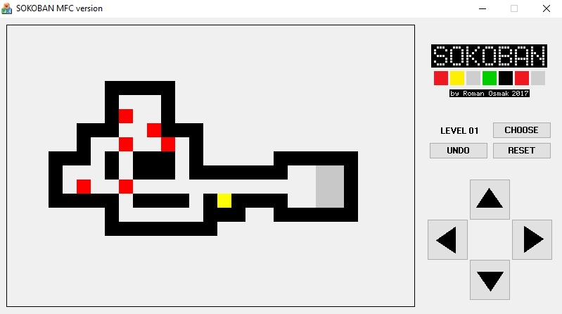

# Sokoban-MFC

Игра написана на Visual C++  с использованием Microsoft Foundation Classes (MFC).

Содержит 60 полнофункциональных уровней.

Из бонусов:

* Возможность выбрать любой уровень
* Возможность отменить сделанный(е) ход(ы) вплоть до начала уровня
* Возможность начать уровень заново

#

#

[Исходный код на GitHub](https://github.com/OsmakRoman/Sokoban-MFC-source-code.git)

 Тестировалась на Windows XP, 7, 10
 
 Скомпилирована на Microsoft Visual Studio 2008 (357 kB)
